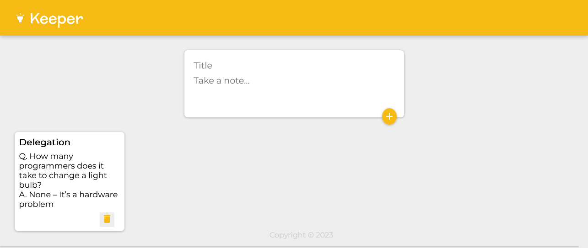
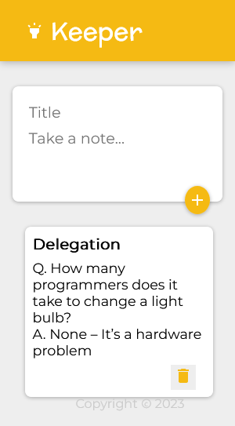

# Keeper-App :
    Create a beautiful responsive keeper-app where user can add new notes and delete the notes.

## Table of contents

- [Overview](#overview)
  - [The challenge](#the-challenge)
  - [Screenshot](#screenshot)
  - [Links](#links)
- [My process](#my-process)
  - [Built with](#built-with)

## Overview

### The challenge

Users should be able to:

- View the optimal layout for the app depending on their device's screen size
- See hover states for all interactive elements on the page
- Add new notes to the list
- Delete notes from the list

### Screenshot

1- 

2- 

### Links

- Live Site URL: [Live site URL](https://raza7522-keeper-app-react.netlify.app)

## My process

### Built with

- Semantic HTML5 markup
- CSS custom properties
- [React](https://reactjs.org/) - JS library
